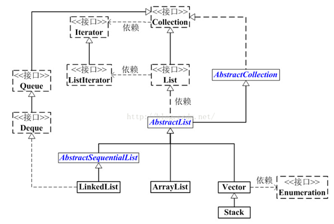
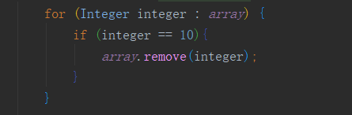
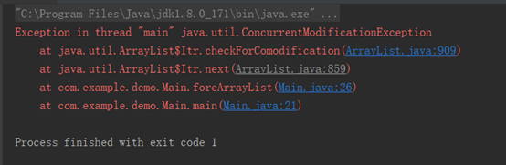
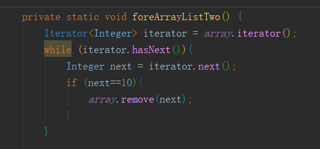
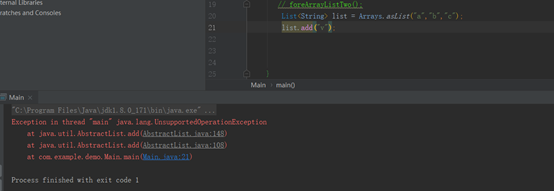
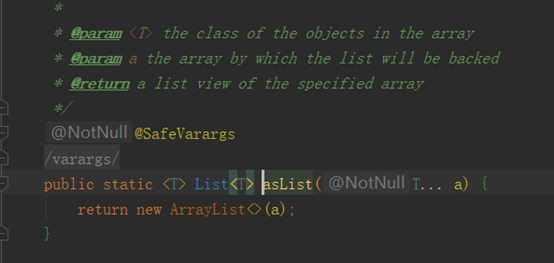

[toc]
# ArrayList与LinkedList的实现和区别。

从图中我们可以看出：

*  List是一个接口，它继承与Collection接口，代表有序的队列。 
*  AbstractList是一个抽象类，它继承与AbstractCollection。AbstractList实现了List接口中除了size()、get(int location)之外的方法。  
*  AbstractSequentialList是一个抽象类，它继承与AbstrctList。AbstractSequentialList实现了“链表中，根据index索引值操作链表的全部方法”。  
*  ArrayList、LinkedList、Vector和Stack是List的四个实现类，其中Vector是基于JDK1.0，虽然实现了同步，但是效率低，已经不用了，Stack继承与Vector，所以不再赘述。  
*  LinkedList是个双向链表，它同样可以被当作栈、队列或双端队列来使用。 
*  ArrayList 数组结构 线程不安全 查找速度快,增加删除速度慢  
*  LinkedList 链表结构 线程不安全 查找速度慢 增加删除速度快
   
我们知道，通常情况下，ArrayList和LinkedList的区别有以上几点：

ArrayList中的随机访问、添加和删除部分源码如下

从源码可以看出，ArrayList想要get(int index)元素时，直接返回index位置上的元素，而LinkedList需要通过for循环进行查找，虽然LinkedList已经在查找方法上做了优化，比如index < size / 2，则从左边开始查找，反之从右边开始查找，但是还是比ArrayList要慢。这点是毋庸置疑的。
ArrayList想要在指定位置插入或删除元素时，主要耗时的是System.arraycopy动作，会移动index后面所有的元素；LinkedList主耗时的是要先通过for循环找到index，然后直接插入或删除。这就导致了两者并非一定谁快谁慢，下面通过一个测试程序来测试一下两者插入的速度：
当数据量较小时，测试程序中，大约小于30的时候，两者效率差不多，没有显著区别；当数据量较大时，大约在容量的1/10处开始，LinkedList的效率就开始没有ArrayList效率高了，特别到一半以及后半的位置插入时，LinkedList效率明显要低于ArrayList，而且数据量越大，越明显。比如我测试了一种情况，在index=1000的位置(容量的1/10)插入10000条数据和在index=5000的位置以及在index=9000的位置插入10000条数据的运行时间如下：

所以当插入的数据量很小时，两者区别不太大，当插入的数据量大时，大约在容量的1/10之前，LinkedList会优于ArrayList，在其后就劣与ArrayList，且越靠近后面越差。所以个人觉得，一般首选用ArrayList，由于LinkedList可以实现栈、队列以及双端队列等数据结构，所以当特定需要时候，使用LinkedList，当然咯，数据量小的时候，两者差不多，视具体情况去选择使用；当数据量大的时候，如果只需要在靠前的部分插入或删除数据，那也可以选用LinkedList，反之选择ArrayList反而效率更高。

## LinkedList for、Iterator遍历查找性能对比

为什么LinkedList的for循环迭代这么慢呢？我们来分析一下原因。其实这已经与Java没啥关系了，主要是与数据结构有关了。

checkElementIndex方法不用看具体实现，目的是判断当前元素是在链表前半段或者后半段然后决定从哪边遍历，后面的node方法决定了具体取元素的过程实现

由于LinkedList是双向链表，因此第6行的意思是算出i在一半前还是一半后，一半前正序遍历、一半后倒序遍历，这样会快很多，当然，先不管这个，分析一下为什么使用普通for循环遍历LinkedList会这么慢。

原因就在两个for循环里面，以前者为例： 1、get(0)，直接拿到0位的Node0的地址，拿到Node0里面的数据

2、get(1)，直接拿到0位的Node0的地址，从0位的Node0中找到下一个1位的Node1的地址，找到Node1，拿到Node1里面的数据

3、get(2)，直接拿到0位的Node0的地址，从0位的Node0中找到下一个1位的Node1的地址，找到Node1，从1位的Node1中找到下一个2位的Node2的地址，找到Node2，拿到Node2里面的数据。

后面的以此类推。也就是说，LinkedList在get任何一个位置的数据的时候，都会把前面的数据走一遍。假如我有10个数据，那么将要查询1+2+3+4+5+5+4+3+2+1=30次数据，相比ArrayList，却只需要查询10次数据就行了，随着LinkedList的容量越大，差距会越拉越大。其实使用LinkedList到底要查询多少次数据，大家应该已经很明白了，来算一下：按照前一半算应该是（1 + 0.5N） * 0.5N / 2，后一半算上即乘以2，应该是（1 + 0.5N） * 0.5N = 0.25N2 + 0.5N，忽略低阶项和首项系数，得出结论，LinikedList遍历的时间复杂度为O(N2)，N为LinkedList的容量。
时间复杂度有以下经验规则： O(1) < O(log2N) < O(n) < O(N * log2N) < O(N2) < 
O(N3) < 2N < 3N < N!
前四个比较好、中间两个一般、后3个很烂。也就是说O(N2)是相对糟糕的一种时间复杂度了，N大一点，程序就会执行得比较慢。

## ArrayList动态扩容的机制
add方法是通过在array的尾部追加元素的方法，添加数据的。其中，调用ensureCapacityInternal方法用来判断是否需要扩容.
参数传的是当前需要的最小容量，方法首先确认当前ArrayList实例是否为空，如果为空则比较所需容量和默认容量，取其较大值作为所需最小容量值。然后执行ensureExplicitCapacity进一步确定容量，以及是否需要扩容。当所需最小容量大于当前elementData数组长度时，要进行扩容操作。
modCount是fail fast机制，不了解也不影响，<u>如果想了解可以看这里</u>,如果minCapacity的值大于添加数据之前的大小，就调用grow方法，进行扩容，否则什么也不做。
发生扩容的条件
根据传入的最小需要容量minCapacity来和数组的容量长度对比，若minCapactity大于或等于数组容量，则需要进行扩容。 (如果实际存储数组是空数组，则最小需要容量就是默认容量)
以上只是真实容量和所需容量的比较，其目的是计算出array的最终容量。真正实现扩容的方法是grow方法。下面具体来了解扩容机制的增长规则
这里传过来的minCapacity的值是array的size+1 添加一个元素，首先计算当前的array所需最小的容量大小，判断是否需要扩容等。 当需要扩容时：

得到当前的ArrayList的容量(oldCapacity)。
计算除扩容后的新容量(newCapacity)，其值(oldCapacity + (oldCapacity >>1))约是oldCapacity 的1.5倍。
这里采用的是移位运算。为什么采用这种方法呢？应该是出于效率的考虑。
当newCapacity小于所需最小容量，那么将所需最小容量赋值给newCapacity。
newCapacity大于ArrayList的所允许的最大容量,处理。进行数据的复制，完成向ArrayList实例添加元素操作。

每次array的size到达当前的容量最大值后，再插入数据就会造成扩容。

## ArrayList是怎么实现序列化与反序列化？怎么自定义序列化机制

Java平台允许我们在内存中创建可复用的Java对象，但一般情况下，只有当JVM处于运行时，这些对象才可能存在，即，这些对象的生命周期不会比JVM的生命周期更长。但在现实应用中，就可能要求在JVM停止运行之后能够保存(持久化)指定的对象，并在将来重新读取被保存的对象。Java对象序列化就能够帮助我们实现该功能。
使用Java对象序列化，在保存对象时，会把其状态保存为一组字节，在未来，再将这些字节组装成对象。必须注意地是，对象序列化保存的是对象的”状态”，即它的成员变量。由此可知
**对象序列化不会关注类中的静态变量**
对象序列化不会关注类中的静态变量

java中的序列化与反序列化都要求对象实现Serializable接口（其实就是声明一下），而对于List这种动态改变的集合默认是不实现这个接口的，也就是不能直接序列化。但是数组是可以序列化的，所以我们只需要将List集合与数组进行转换就可以实现序列化与反序列化了。

序列化及反序列化相关知识
1、在Java中，只要一个类实现了java.io.Serializable接口，那么它就可以被序列化。
2、通过ObjectOutputStream和ObjectInputStream对对象进行序列化及反序列化
3、虚拟机是否允许反序列化，不仅取决于类路径和功能代码是否一致，一个非常重要的一点是两个类的序列化 ID 是否一致（就是 private static final long 
serialVersionUID）
4、序列化并不保存静态变量。
5、要想将父类对象也序列化，就需要让父类也实现Serializable 接口。
6、Transient 关键字的作用是控制变量的序列化，在变量声明前加上该关键字，可以阻止该变量被序列化到文件中，在被反序列化后，transient 变量的值被设为初始值，如 int 型的是 0，对象型的是 null。
7、服务器端给客户端发送序列化对象数据，对象中有一些数据是敏感的，比如密码字符串等，希望对该密码字段在序列化时，进行加密，而客户端如果拥有解密的密钥，只有在客户端进行反序列化时，才可以对密码进行读取，这样可以一定程度保证序列化对象的数据安全。

了解ArrayList的人都知道，ArrayList底层是通过数组实现的。那么数组elementData其实就是用来保存列表中的元素的。通过该属性的声明方式我们知道，他是无法通过序列化持久化下来的。那么为什么code 4的结果却通过序列化和反序列化把List中的元素保留下来了呢？

首先通过s.defaultWriteObject();对非transient变量进行了序列化。然后又通过
for (int i=0; i<size; i++) { s.writeObject(elementData[i]); }
这个循环对数组中的有值的元素逐个进行了序列化操作。
反序列化时也是一样，首先通过s.defaultReadObject();对非transient变量进行了反序列化。然后又通过
for (int i=0; i<size; i++) { a[i] = s.readObject(); }
这个循环对数组中的有值的元素逐个进行反序列化操作。
ArrayList实际上是动态数组，每次在放满以后自动增长设定的长度值，如果数组自动增长长度设为100，而实际只放了一个元素，那就会序列化99个null元素。为了保证在序列化的时候不会将这么多null同时进行序列化，ArrayList把元素数组设置为transient。
之所以这样的一个原因是ArrayList的值数组elementData的大小并不一定等于数组的size的大小。size是ArrayList中add进的个数。由于ArrayList有动态扩容的机制，所以elementData的大小总是大于size.所以通过对elementData中有效的元素进行逐个的序列化可以明显的提高效率。
对象的序列化过程通过ObjectOutputStream和ObjectInputputStream来实现的，那么带着刚刚的问题，我们来分析一下ArrayList中的writeObject 和 
readObject 方法到底是如何被调用的呢？

writeObject ---> writeObject0 
--->writeOrdinaryObject--->writeSerialData--->invokeWriteObject
其中writeObjectMethod.invoke(obj, new Object[]{ out });是关键，通过反射的方式调用writeObjectMethod方法。

ArrayList遍历修改ConcurrentModificationException？

删除某个元素后，list的大小发生了变化，而你的索引也在变化，所以会导致你在遍历的时候漏掉某些元素。比如当你删除第1个元素后，继续根据索引访问第2个元素时，因为删除的关系后面的元素都往前移动了一位，所以实际访问的是第3个元素。因此，这种方式可以用在删除特定的一个元素时使用，但不适合循环删除多个元素时使用。

a.从list最后一元素开始开始遍历。
b.i--
ConcurrentModificationException错误的发生
增强for循环

删除元素后继续循环会报错误信息ConcurrentModificationException，因为元素在使用的时候发生了并发的修改，导致异常抛出
解决：删除完毕马上使用break跳出，则不会触发报错。
iterator遍历

这种方式可以正常的循环及删除。但要注意的是，使用iterator的remove方法
总结
循环删除list中特定一个元素的，可以使用三种方式中的任意一种，但在使用中要注意上面分析的各个问题。
循环删除list中多个元素的，应该使用迭代器iterator方式，或者list从后往前删除。
以下介绍异常产生原因
ArrayList:
注意，迭代器的快速失败行为无法得到保证，因为一般来说，不可能对是否出现不同步并发修改做出任何硬性保证。快速失败迭代器会尽最大努力抛出 
ConcurrentModificationException。因此，为提高这类迭代器的正确性而编写一个依赖于此异常的程序是错误的做法：迭代器的快速失败行为应该仅用于检测 bug。
HashMap 中：
注意，迭代器的快速失败行为不能得到保证，一般来说，存在非同步的并发修改时，不可能作出任何坚决的保证。快速失败迭代器尽最大努力抛出 
ConcurrentModificationException。因此，编写依赖于此异常的程序的做法是错误的，正确做法是：迭代器的快速失败行为应该仅用于检测程序错误。
在这两段话中反复地提到”快速失败”。那么何为”快速失败”机制呢？
“快速失败”也就是 fail-fast，它是 Java 集合的一种错误检测机制。当多个线程对集合进行结构上的改变的操作时，有可能会产生 fail-fast 机制。记住是有可能，而不是一定。例如：假设存在两个线程（线程 1、线程 2），线程 1 通过 Iterator 在遍历集合 A 中的元素，在某个时候线程 2 修改了集合 A 的结构（是结构上面的修改，而不是简单的修改集合元素的内容），那么这个时候程序就会抛出 
ConcurrentModificationException 异常，从而产生 fail-fast 机制。

## Arrays.asList的坑

在java语言中，把数组转换成List集合，有个很方便的方法就是 List<String> list = 
Arrays.asList("a","b","c");

当你看到这段代码时可能觉得没啥问题啊，不就是返回了一个ArrayList对象吗？问题就出在这里。这个ArrayList不是java.util包下的，而是java.util.Arrays.ArrayList，显然它是Arrays类自己定义的一个内部类！这个内部类没有实现add()、remove()方法，而是直接使用它的父类AbstractList的相应方法。而AbstractList中的add()和remove()是直接抛出java.lang.UnsupportedOperationException异常的！

